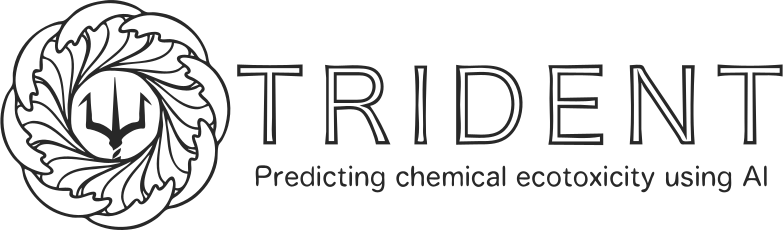

# 
[](https://opensource.org/licenses/MIT)

## Overview
This repository contains code for the TRIDENT web application available through [TRIDENT - predicting chemical ecotoxicity using AI](https://trident.serve.scilifelab.se/), associated with the publication [Transformers enable accurate prediction of acute and chronic chemical toxicity in aquatic organisms](https://www.biorxiv.org/content/10.1101/2023.04.17.537138v1) (*preprint*).

See also: [TRIDENT](https://github.com/StyrbjornKall/TRIDENT)

## How to Use
Please refer to our hosted web application: [TRIDENT - predicting chemical ecotoxicity using AI](https://trident.serve.scilifelab.se/).

If you do wish to run this streamlit application locally, either clone this repo or fetch the Docker image available in Docker hub  To replicate the study, refer to the documentation under the `development` section.

Clone this repository:
```bash 
git clone https://github.com/StyrbjornKall/TRIDENT_application
```
